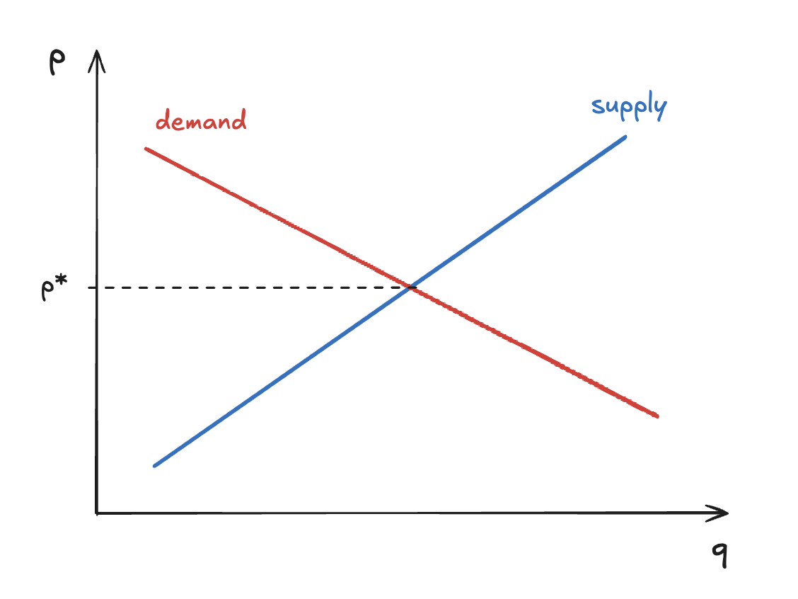
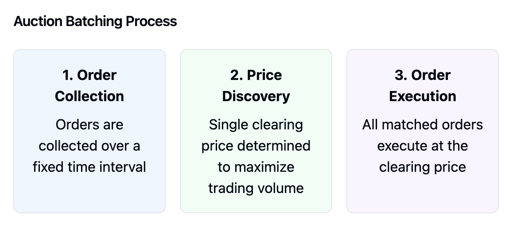

# Frequent Batch Auctions

Frequent Batch Auctions (FBAs) are an innovative market design that aims to create fairer and more efficient financial markets. In FBAs, orders are collected over a fixed time interval and all orders in a batch are processed together. Blockchains create a natural batching interval defined by the block time (~400ms in Solana).

The process occurs in three main steps:

1. **Order Collection**

   - During each interval, all incoming buy and sell orders are collected
   - No trading occurs during collection

2. **Price Discovery**

   - Orders are aggregated to create supply and demand curves
   - Matching engine finds the price where supply and demand curves intersect

3. **Order Execution**

   - All matched orders execute simultaneously at the clearing price p\*

FBAs help ensure that prices reflect true supply and demand rather than technical artifacts of the trading system.
